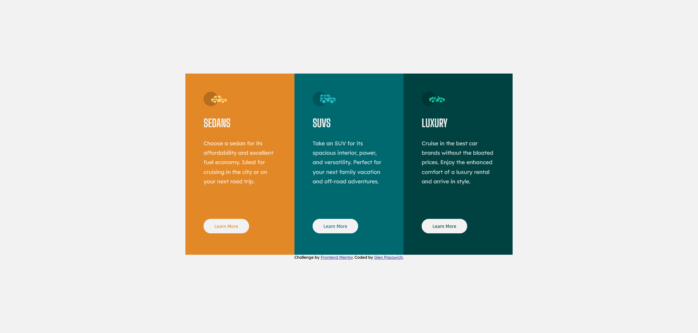

# Frontend Mentor - 3-column preview card component solution

This is a solution to the [3-column preview card component challenge on Frontend Mentor](https://www.frontendmentor.io/challenges/3column-preview-card-component-pH92eAR2-). Frontend Mentor challenges help you improve your coding skills by building realistic projects.

## Table of contents

- [Overview](#overview)
  - [Screenshot](#screenshot)
  - [Links](#links)
- [My process](#my-process)
  - [Built with](#built-with)
- [Author](#author)

## Overview

This is my take on the 3 column preview card component.

### Screenshot

### Links

- Solution URL: [Source code here](https://github.com/electricman07/3-column-preview-card-component)
- Live Site URL: [Live preview here](https://3-column-preview-card-component-lake.vercel.app)

## My process

### Built with

- Semantic HTML5 markup
- CSS custom properties
- Flexbox

## Author

- Website - [Glen Popowich](https://github.com/electricman07)
- Frontend Mentor - [@electricman07](https://www.frontendmentor.io/profile/electricman07)
- Twitter - [@glen_popowich](https://www.twitter.com/glen_popowich)
